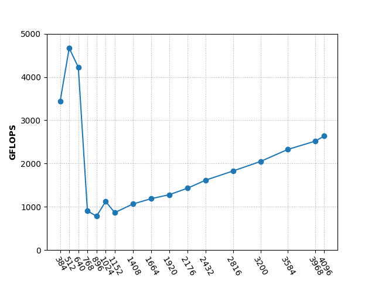
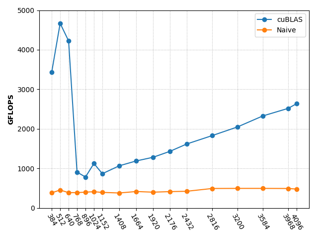
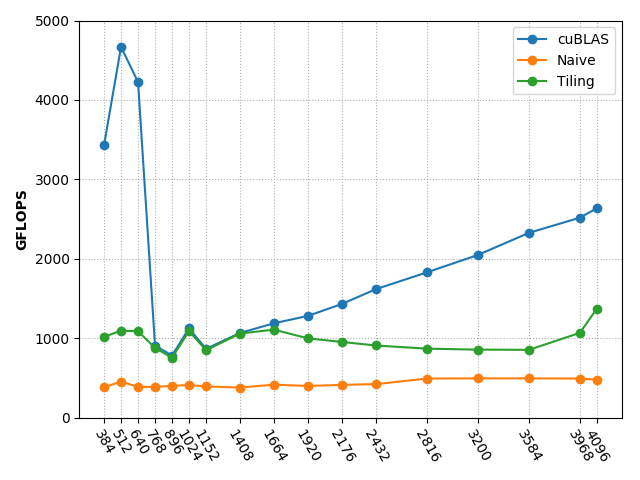
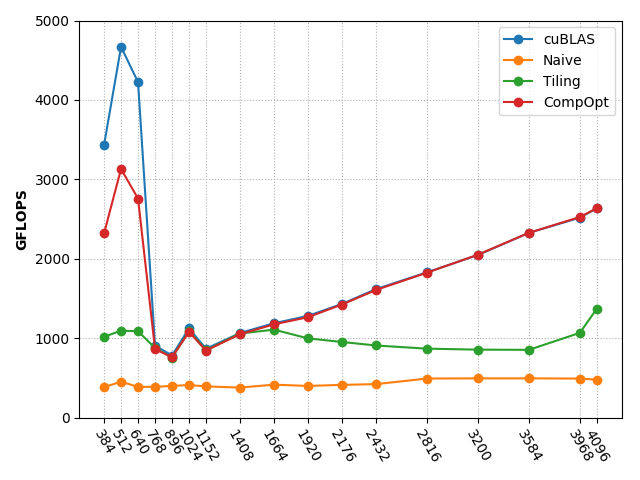

# SGEMM Implementation and Optimization on CUDA

This is a summer intern project in Advanced Computer Architecture Lab, SJTU. SGEMM means **floating point matrix multiplication**. I implemented matrix multiplication on CUDA-8.0 based on **five** different method. Some of the methods archieved almost the same performance as cuBLAS.

## Device Properties
Name:  GeForce GTX 1080 Ti

Compute capability:  6.1

## Methods
All the methods are based on the basic multiplication method, whose **time complexity** is O(N<sup>3</sup>). So the optimization focused on low level method, such as reduce the accession in global memory and the number of instructions.

The key idea for CUDA programming is properly assigning work to each threads. Then consider the grid size and block size according to specific matrix size. The main difficulty is to correctly index each value.

We use **GFLOPS** to measure the performance of different methods. In computing, **floating point operations per second(FLOPS)** is a measure of computer performance. It is also commonly used in researches about matrix multiplication on GPU. 

Consider matrix multiplication: ``A(MxK)`` x ``B(KxN)`` = ``C(MxN)``. If the time spent on computing is ``t``, the **GFLOPS** is:

``2xMxKxN / t / 1e9``

In the experiment, I evaluate GFLOPS with different size of matrix.

### Benchmark(cuBLAS)
The perforamce of cuBLAS is as follows:


### Naive Method
Each thread calculates one value of output matrix ``C``. This is quite simple and straight forward. Performance:


### Tiling Method
Each thread loads one value of ``TxT`` submatrix of ``A`` and ``B`` and calculate one value of submatrix of ``C``. We need to iterate ``K / T`` times to accumulate the value of submatrix of ``C``.


### CompOpt Method
CompOpt is **Computational Optimization**. The current architecture of Stream Multiprocessor(SM) only allows one source operand from the shared memory. However, computing the inner product requires two source operands from the shared memory. One solution is to **perform outer product instead of inner product**.

In this method, matrix A is stored in shared memory with TILE size of ``TxT``, but matrix B and C are stored in registers. Each thread needs to load ``TILE_SIZE / VECTOR_SIZE`` values of A and a vector of C with size of ``TILE_SIZE``(As(``TILE_SIZE``x1) x Bv). Here ``VECTOR_SIZE`` is another parameters.


## Miscellaneous

Compile the file as follows:

```
nvcc *.cu --std=c++11
```

This project was mainly inspired by this [tuorial](http://www.es.ele.tue.nl/~mwijtvliet/5KK73/?page=mmcuda#TOC-Prefetching). I refine the code to avoid hard coding.
